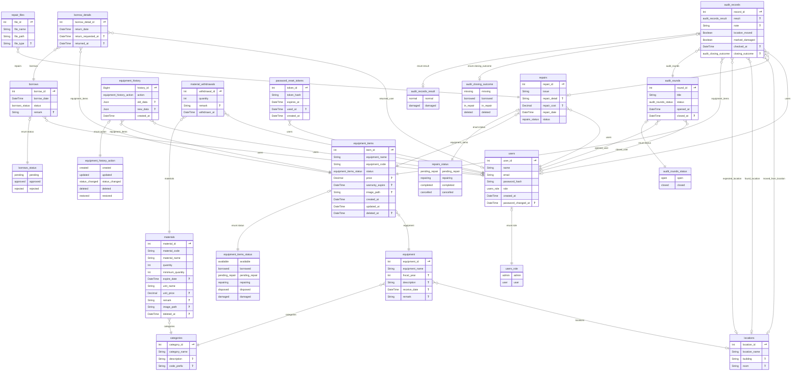

```mermaid
erDiagram

        equipment_history_action {
            created created
updated updated
status_changed status_changed
deleted deleted
restored restored
        }
    


        equipment_items_status {
            available available
borrowed borrowed
pending_repair pending_repair
repairing repairing
disposed disposed
damaged damaged
        }
    


        users_role {
            admin admin
user user
        }
    


        borrows_status {
            pending pending
approved approved
rejected rejected
        }
    


        repairs_status {
            pending_repair pending_repair
repairing repairing
completed completed
cancelled cancelled
        }
    


        audit_rounds_status {
            open open
closed closed
        }
    


        audit_records_result {
            normal normal
damaged damaged
        }
    


        audit_closing_outcome {
            missing missing
borrowed borrowed
in_repair in_repair
deleted deleted
        }
    
  "categories" {
    Int category_id "🗝️"
    String category_name 
    String description "❓"
    String code_prefix "❓"
    }
  

  "equipment" {
    Int equipment_id "🗝️"
    String equipment_name 
    Int fiscal_year "❓"
    String description "❓"
    DateTime receive_date "❓"
    String remark "❓"
    }
  

  "equipment_history" {
    BigInt history_id "🗝️"
    equipment_history_action action 
    Json old_data "❓"
    Json new_data "❓"
    DateTime created_at 
    }
  

  "equipment_items" {
    Int item_id "🗝️"
    String equipment_name 
    String equipment_code 
    equipment_items_status status 
    Decimal price "❓"
    DateTime warranty_expire "❓"
    String image_path "❓"
    DateTime created_at 
    DateTime updated_at 
    DateTime deleted_at "❓"
    }
  

  "locations" {
    Int location_id "🗝️"
    String location_name 
    String building "❓"
    String room "❓"
    }
  

  "materials" {
    Int material_id "🗝️"
    String material_code 
    String material_name 
    Int quantity 
    Int minimum_quantity 
    DateTime expire_date "❓"
    String unit_name 
    Decimal unit_price "❓"
    String remark "❓"
    String image_path "❓"
    DateTime deleted_at "❓"
    }
  

  "material_withdrawals" {
    Int withdrawal_id "🗝️"
    Int quantity 
    String remark "❓"
    DateTime withdrawn_at 
    }
  

  "users" {
    Int user_id "🗝️"
    String name 
    String email 
    String password_hash 
    users_role role 
    DateTime created_at 
    DateTime password_changed_at "❓"
    }
  

  "password_reset_tokens" {
    Int token_id "🗝️"
    String token_hash 
    DateTime expires_at 
    DateTime used_at "❓"
    DateTime created_at 
    }
  

  "borrow_details" {
    Int borrow_detail_id "🗝️"
    DateTime return_date 
    DateTime return_requested_at "❓"
    DateTime returned_at "❓"
    }
  

  "borrows" {
    Int borrow_id "🗝️"
    DateTime borrow_date 
    borrows_status status 
    String remark "❓"
    }
  

  "repair_files" {
    Int file_id "🗝️"
    String file_name 
    String file_path 
    String file_type "❓"
    }
  

  "repairs" {
    Int repair_id "🗝️"
    String issue 
    String repair_detail "❓"
    Decimal repair_cost "❓"
    DateTime repair_date 
    repairs_status status 
    }
  

  "audit_rounds" {
    Int round_id "🗝️"
    String title 
    audit_rounds_status status 
    DateTime opened_at 
    DateTime closed_at "❓"
    }
  

  "audit_records" {
    Int record_id "🗝️"
    audit_records_result result "❓"
    String note "❓"
    Boolean location_moved 
    Boolean marked_damaged 
    DateTime checked_at "❓"
    audit_closing_outcome closing_outcome "❓"
    }
  
    "equipment" }o--|| "categories" : "categories"
    "equipment" }o--|o "locations" : "locations"
    "equipment_history" |o--|| "equipment_history_action" : "enum:action"
    "equipment_history" }o--|| "equipment_items" : "equipment_items"
    "equipment_history" }o--|o "users" : "users"
    "equipment_items" |o--|| "equipment_items_status" : "enum:status"
    "equipment_items" }o--|| "equipment" : "equipment"
    "materials" }o--|| "categories" : "categories"
    "material_withdrawals" }o--|| "materials" : "materials"
    "material_withdrawals" }o--|| "users" : "users"
    "users" |o--|| "users_role" : "enum:role"
    "password_reset_tokens" }o--|| "users" : "users"
    "borrow_details" }o--|| "borrows" : "borrows"
    "borrow_details" }o--|| "equipment_items" : "equipment_items"
    "borrow_details" }o--|o "users" : "returned_user"
    "borrows" |o--|| "borrows_status" : "enum:status"
    "borrows" }o--|| "users" : "users"
    "repair_files" }o--|| "repairs" : "repairs"
    "repairs" |o--|| "repairs_status" : "enum:status"
    "repairs" }o--|| "equipment_items" : "equipment_items"
    "repairs" }o--|| "users" : "users"
    "audit_rounds" |o--|| "audit_rounds_status" : "enum:status"
    "audit_rounds" }o--|| "users" : "opened_user"
    "audit_rounds" }o--|o "users" : "closed_user"
    "audit_records" |o--|o "audit_records_result" : "enum:result"
    "audit_records" |o--|o "audit_closing_outcome" : "enum:closing_outcome"
    "audit_records" }o--|| "audit_rounds" : "audit_rounds"
    "audit_records" }o--|| "equipment_items" : "equipment_items"
    "audit_records" }o--|o "locations" : "expected_location"
    "audit_records" }o--|o "locations" : "found_location"
    "audit_records" }o--|o "locations" : "moved_from_location"
    "audit_records" }o--|o "repairs" : "repairs"
    "audit_records" }o--|o "users" : "users"
```
